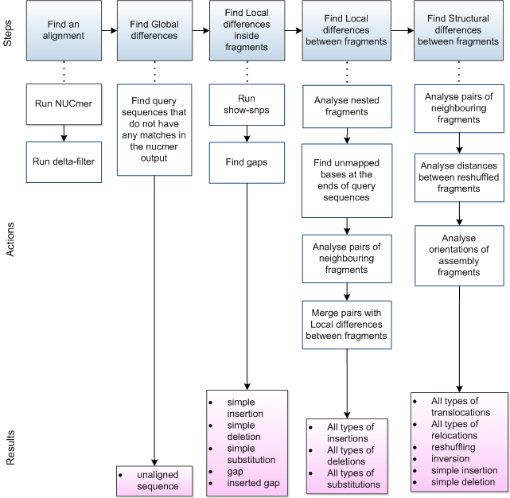
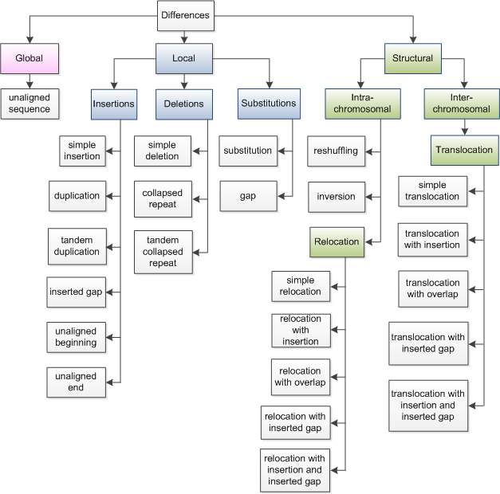

# NucDiff manual

<br><br>
## 1 Introduction
NucDiff locates and categorizes differences between two closely related nucleotide sequences. It is able to deal with very fragmented genomes, structural rearrangements and various local differences. These features make NucDiff to be perfectly suitable to compare assemblies with each other or with available reference genomes.   

NucDiff provides information about the types of differences and their locations. It is possible to upload the results into genome browser for visualization and further inspection. It was written in Python and uses the NUCmer package from MUMmer[1] for sequence comparison. 

<br><br>
## 2 Prerequisites
NucDiff can be run on Linux and Mac OS. It uses Python 2.7, MUMmer v3.23 and the Biopython package. MUMmer and the Biopython package should be installed and be in the PATH before running NucDiff.  

The MUMmer tarball can be downloaded at http://sourceforge.net/projects/mummer/ .
The Biopython package can be downloaded at http://biopython.org/wiki/Download . 

<br><br>
## 3 Running NucDiff
### 3.1 Command line syntax and input arguments
To run NucDiff, run `nucdiff.py` script with valid input arguments:

```
$ python  nucdiff.py [-h] [--reloc_dist [int]]
                          [--nucmer_opt [NUCMER_OPT]]
                          [--filter_opt [FILTER_OPT]] 
                          [--delta_file [DELTA_FILE]]
                          [--proc [int]] 
                          [--ref_name_full [{yes,no}]]
                          [--query_name_full [{yes,no}]] 
                          [--vcf [{yes,no}]]
                          [--version]
                          Reference.fasta Query.fasta Output_dir Prefix

```

Positional arguments:
*  **Reference.fasta** - Fasta file with the reference sequences
*  **Query.fasta** - Fasta file with the query sequences
*  **Output_dir** - Path to the directory where all intermediate and final results will be stored
*  **Prefix** - Name that will be added to all generated files including the ones created by NUCmer

Optional arguments:
*  **-h, --help** - show this help message and exit
*  **--reloc_dist** - Minimum distance between two relocated blocks [10000]
*  **--nucmer_opt** - NUCmer run options. By default, NUCmer will be run with its default parameters values, except the  --maxmatch parameter. --maxmatch is hard coded and cannot be changed. To change any other parameter values, type parameter names and new values inside single or double quotation marks.
*  **--filter_opt** - Delta-filter run options. By default, it will be run with -q parameter only. -q is hard coded and cannot be changed. To add any other parameter values, type parameter names and their values inside single or double quotation marks.
*  **--delta_file** - Path to the already existing delta file (NUCmer output file)
*  **--proc** - Number of processes to be used [1]
*  **--ref_name_full** - Print full reference names in output files ('yes' value). In case of 'no', everything after the first space will be ignored. ['no']
*  **--query_name_full** - Print full query names in output files ('yes' value). In case of 'no', everything after the first space will be ignored. ['no']
*  **--vcf [{yes,no}]** - Output small and medium local differences in the VCF format ['no']
*  **--version** - show program's version number and exit

<br><br>
### 3.2 Running examples
A running example with NucDiff and NUCmer predefined parameters values, except NUCmer --maxmatch parameter and delta-filter -q parameter.  --maxmatch is hard coded and cannot be changed neither to --mum nor to --mumreference. -q is also hard coded and cannot be changed neither to -g nor to -r:

```
$python nucdiff.py my_reference.fasta my_query.fasta my_output_dir my_prefix
```

<br><br>
A running example when user needs to change NUCmer and NucDiff default parameter values:

```
$python nucdiff.py --proc 5 --ref_name_full yes --query_name_full yes --nucmer_opt '-c 200 -l 250' my_reference.fasta my_query.fasta my_output_dir my_prefix
```
<br><br>
A detailed description of all possible NUCmer and delta-filter parameters as well as the .delta and .coord output files can be found in MUMmer manual at http://mummer.sourceforge.net/manual/ .

<br><br>
## 4 Method overview
### 4.1 NucDiff steps
The NucDiff workflow is shown in Figure 1. The detailed description of all steps can be found in [2].



Figure 1: The NucDiff workflow
<br><br>
### 4.2 Types of differences
All types of differences are classified into 3 groups: Global, Local and Structural (Figure 2). 




Figure 2: Classification of the types of differences with group names found in coloured boxes with capitalised names and the specific types found in white boxes with lowercase names.
<br><br>

The definitions of all types of differences can be found in [2] and in GithHub wiki (https://github.com/uio-cels/NucDiff/wiki ). 


<br><br>
## 5. NucDiff output
NucDiff puts its output in the directory `<output_dir>/results`. The output consists of 9 files  : 
* &lsaquo;prefix&rsaquo;_ref_snps.gff 
* &lsaquo;prefix&rsaquo;_ref_struct.gff 
* &lsaquo;prefix&rsaquo;_ref_blocks.gff
* &lsaquo;prefix&rsaquo;_ref_snps.vcf 
* &lsaquo;prefix&rsaquo;_query_snps.gff 
* &lsaquo;prefix&rsaquo;_query_struct.gff 
* &lsaquo;prefix&rsaquo;_query_blocks.gff
* &lsaquo;prefix&rsaquo;_query_snps.vcf
* &lsaquo;prefix&rsaquo;_stat.out 


A detailed description of all output files can be found in GithHub wiki (https://github.com/uio-cels/NucDiff/wiki ).

A detailed description of used GFF3 and VCF file formats can be also found at https://github.com/The-Sequence-Ontology/Specifications/blob/master/gff3.md and https://samtools.github.io/hts-specs/VCFv4.2.pdf , respectively. 

## 6.Citing NucDiff

To cite your use of NucDiff in your publication:

Khelik K, Lagesen K, Sandve GK, Rognes T, Nederbragt AJ. NucDiff: in-depth characterization and annotation of differences between two sets of DNA sequences. BMC Bioinformatics. 2017;18(1):338. doi: 10.1186/s12859-017-1748-z. 


<br><br>
## References
[1] Kurtz S et al. Versatile and open software for comparing large genomes. Genome Biol. 2004;5(2):R12. doi 10.1186/gb-2004-5-2-r12.

[2] Khelik K et al. NucDiff: in-depth characterization and annotation of differences between two sets of DNA sequences. BMC Bioinformatics. 2017;18(1):338. doi: 10.1186/s12859-017-1748-z.